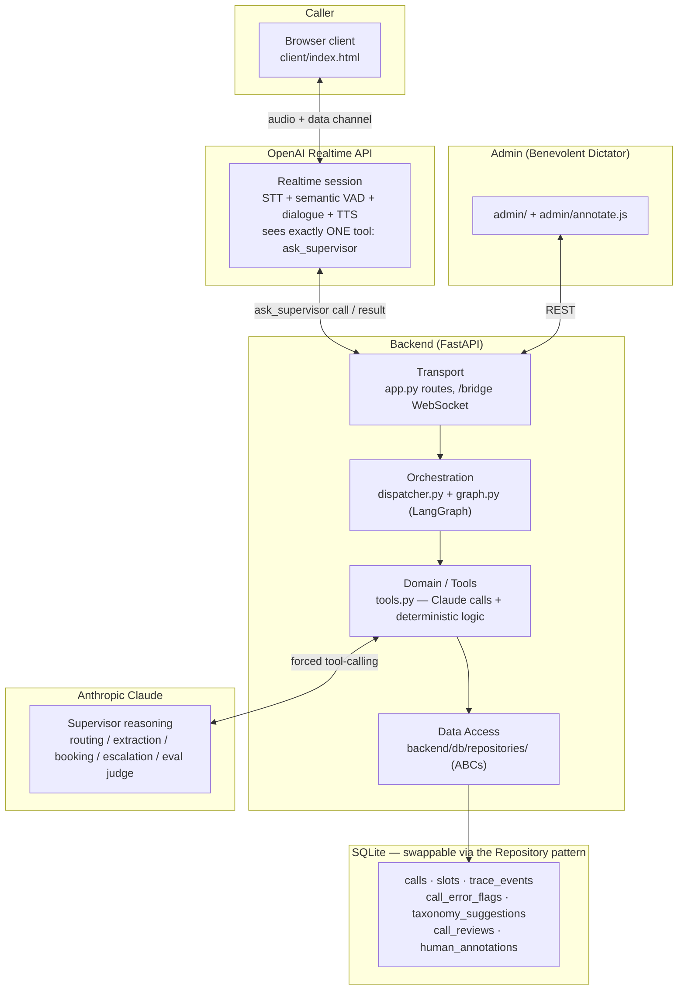
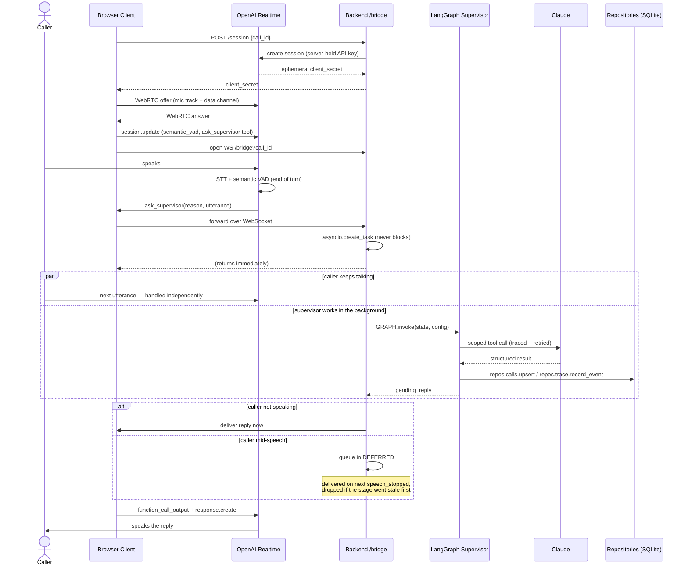
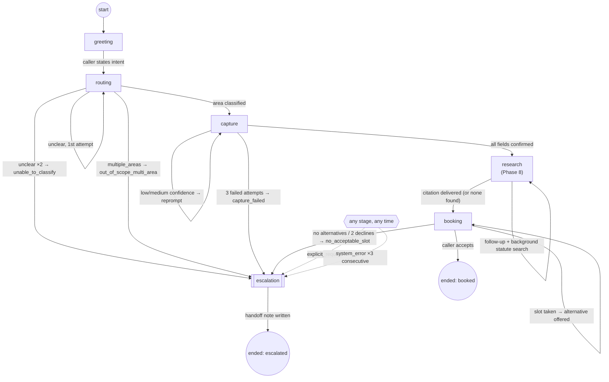
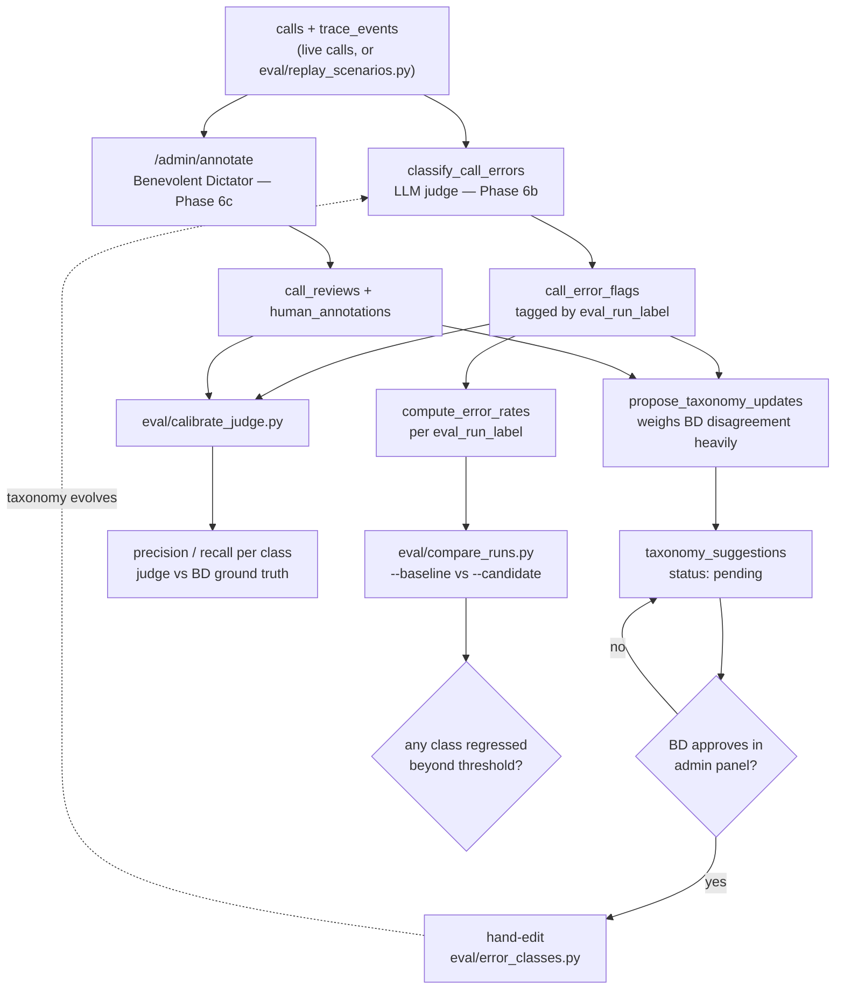

# Architecture Diagrams

Four diagrams for presenting Jupus: the layered system architecture, the full call sequence (including the async/non-blocking supervisor dispatch), the LangGraph state machine, and the eval/Benevolent-Dictator data flow. Each corresponds to a section of `docs/PLAN.md` / `docs/architecture.md` — these are visual summaries, not a separate source of truth; if a diagram and a doc ever disagree, the doc wins.

---

## 1. System architecture

Layered shape from `docs/architecture.md`: transport → orchestration → domain/tools → data access, with the Realtime/Claude/SQLite boundaries.

---

## 2. Call sequence

The full round trip from `docs/PLAN.md`, including the non-blocking dispatch that lets the caller keep talking while the supervisor works (Phase 5).

---

## 3. LangGraph state machine

Nodes, edges, and every escalation trigger from `docs/PLAN.md` and Phase 5.

`explicit_request` (a deterministic keyword match, checked before the current stage's node runs) and `system_error` (3 consecutive upstream API failures, any node) can fire from anywhere — the dashed `any stage, any time` node represents that, it isn't a real graph state.

---

## 4. Eval / Benevolent Dictator data flow

How a call becomes a classified, calibrated, regression-testable data point — `docs/error_taxonomy.md`, `docs/benevolent_dictator.md`, Phases 6a–6c.

