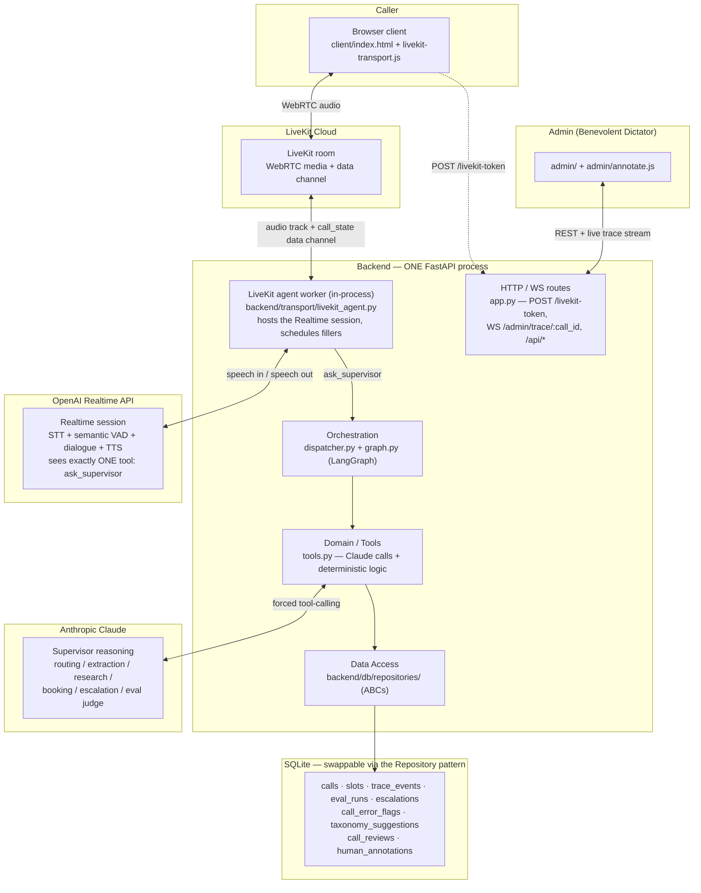
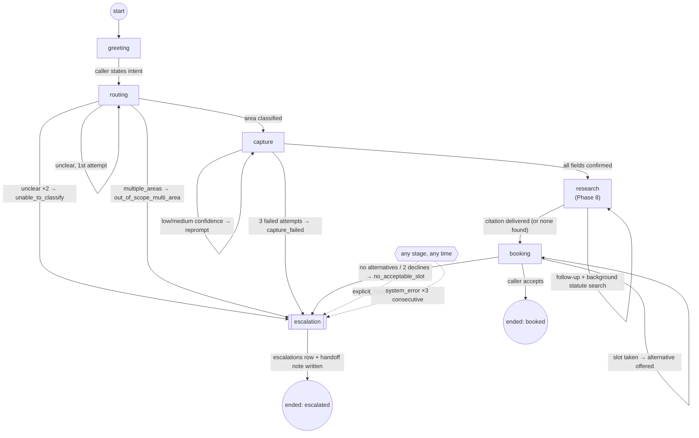
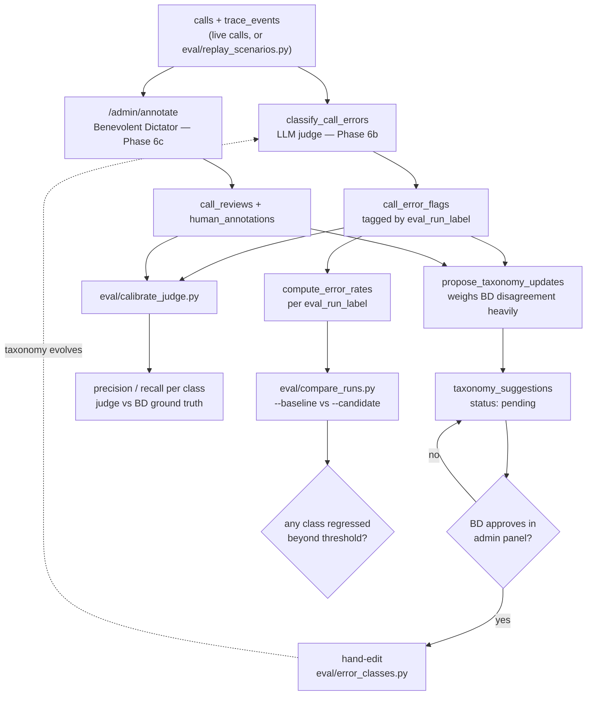

# Architecture Diagrams

Three diagrams for presenting Jupus: the layered system architecture, the LangGraph state machine, and the eval/Benevolent-Dictator data flow. Each corresponds to a section of `docs/PLAN.md` / `docs/architecture.md` — these are visual summaries, not a separate source of truth; if a diagram and a doc ever disagree, the doc wins.

> A fourth diagram, a call sequence, was removed after Phase 14. It described the hand-rolled `/bridge` WebSocket transport — `POST /session`, browser-side `session.update`, fire-and-forget `asyncio.create_task`, and the `SPEAKING`/`DEFERRED` delivery queue — all of which the LiveKit migration deleted (`docs/phases/phase-14-livekit-transport.md`, Decision 5). Rather than leave a diagram that would send a reader looking for a WebSocket that no longer exists, it's gone; `docs/reference/life-of-a-call.md` describes the current round trip in prose.

---

## 1. System architecture

Layered shape from `docs/architecture.md`: transport → orchestration → domain/tools → data access, with the LiveKit/Realtime/Claude/SQLite boundaries.

The agent worker runs **inside the backend process**, not as a separate service — that is what lets it read in-memory call state directly and keeps the live admin view working, at the cost of one process doing real-time media work alongside serving HTTP. See the README's "Known limits" and the one-worker rule in `docs/reference/operations.md`.

---

## 2. LangGraph state machine

Nodes, edges, and every escalation trigger from `docs/PLAN.md` and Phase 5. Drawn at *stage* level, matching `CallState.stage` — the `capture` stage splits internally into `capture_fast`/`capture_confirm` nodes, and `research` into `research_gather`/`research_deliver`.

`explicit_request` (a deterministic keyword match in `dispatcher.py`, checked before the current stage's node runs) and `system_error` (3 consecutive upstream API failures, any node) can fire from anywhere — the dashed `any stage, any time` node represents that, it isn't a real graph state.

---

## 3. Eval / Benevolent Dictator data flow

How a call becomes a classified, calibrated, regression-testable data point — `docs/error_taxonomy.md`, `docs/benevolent_dictator.md`, Phases 6a–6c.

